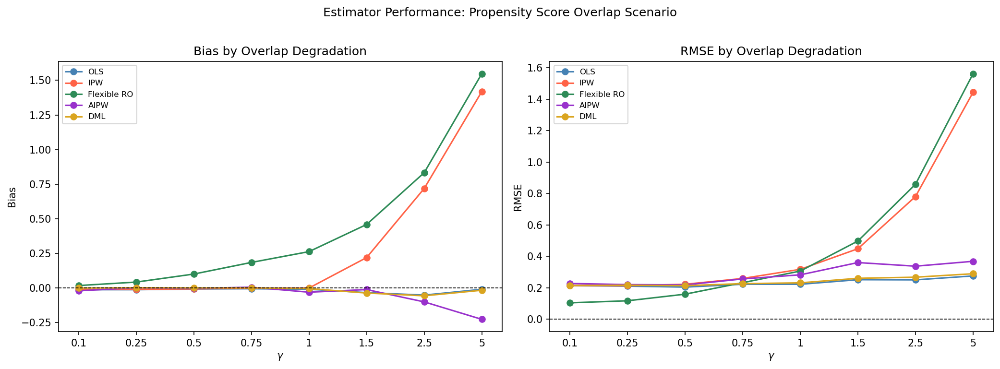
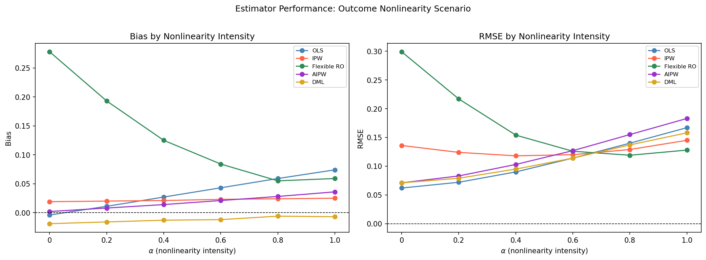
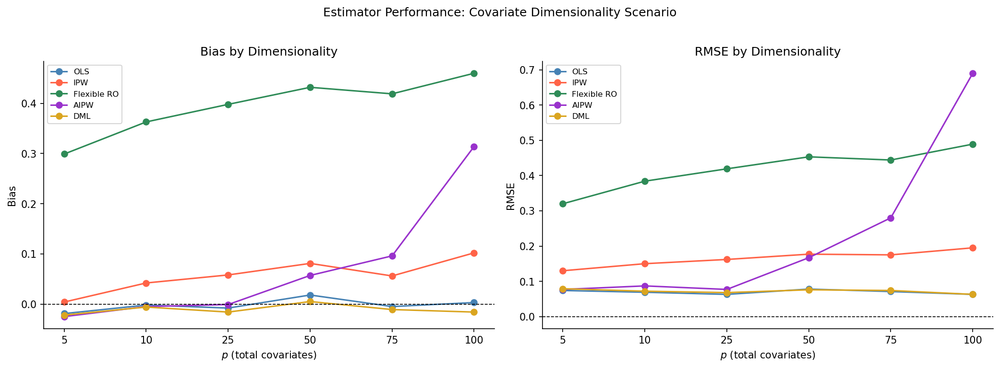

# Causal Lab: ATE Recovery Under Controlled DGP with Observable Confounders


## Summary

- Benchmarks five causal estimators on their ability to recover a known average treatment effect (ATE = 2.0) from synthetic data where all confounders are observed by construction.
- Evaluates performance across three DGP scenarios: (i) overlap degradation; (ii) outcome nonlinearity; and (iii) high dimensionality — each with a systematic knob modulating stress intensity.
- Demonstrates that even in the selection-on-observables setting, naive methods fail in distinct and predictable ways depending on the structural feature under stress.

---

## What is the project about?

Causal inference methods address two distinct challenges: identification and estimation. Design-based approaches such as difference-in-differences, regression discontinuity, and instrumental variables are primarily concerned with identification: recovering causal effects in settings where unobserved confounding may be present.

But what happens when we observe everything? Or even more than we need to?

This is the selection-on-observables setting, where all relevant confounders are assumed to be measured, so the identification problem is, in principle, resolved. Conditional on $X$, treatment is as good as random, and the causal effect is identified. What remains is the estimation problem: how best to recover that effect in finite samples.

In practice, however, this “easy case” is often less straightforward than it appears. Even with full observability, estimators can still perform poorly because of structural issues such as propensity score instability, functional form misspecification, or high-dimensional covariate spaces. The choice of estimator, and the assumptions built into it, still matter.

This project stress-tests five popular ATE estimators under controlled synthetic DGPs where the ground truth is known. Each scenario isolates a single structural feature and varies it systematically while holding the others fixed, making it easier to relate estimator performance to specific design features rather than incidental quirks of the data.

> When identification is available under selection on observables, which estimators remain most reliable as key structural features of the data — overlap, functional form, and dimensionality — are systematically stressed?

---

## Estimator Suite

Five estimators are evaluated, spanning simple regression-based methods through to doubly robust and cross-fitted approaches:

| Estimator | Description |
|---|---|
| **OLS** | Linear regression via `statsmodels`, with the treatment effect recovered as the coefficient on `T`. |
| **IPW** | Horvitz-Thompson reweighting using logistic propensity scores from `sklearn`. |
| **Flexible RO** | T-learner with two Random Forest outcome models from `sklearn`. |
| **AIPW** | Doubly robust estimator via `econml.dr.LinearDRLearner`. |
| **DML** | Double Machine Learning via `econml.dml.LinearDML` with cross-fitted nuisance models. |

All estimators are implemented in `src/ate_suite.py` with fixed specifications across scenarios.

---

## Scenarios and Key Findings

### Scenario 1: Overlap Degradation

Overlap is degraded by scaling the log-odds of treatment assignment by $\gamma$.
At low $\gamma$, assignment is close to random and treated and control units have
substantial overlap in propensity scores. As $\gamma$ increases, the score
distributions become more separated and common support weakens.



- **OLS** and **DML** appear comparatively stable throughout.  OLS remains close to zero bias with only a modest increase in RMSE, while DML also stays near zero bias and is among the more stable estimators as overlap deteriorates.
- **IPW** and **Flexible RO** show the clearest deterioration as $\gamma$ rises. IPW becomes increasingly sensitive to extreme propensity scores, while Flexible RO appears to struggle as the treated and control outcome models are asked to predict more often in weakly represented regions of the covariate space.
- **AIPW** remains close to unbiased over much of the grid, but its RMSE rises at higher $\gamma$, which is consistent with growing instability as overlap worsens even when average bias remains relatively limited.

---

### Scenario 2: Outcome Nonlinearity

The outcome surface interpolates between purely linear and fully nonlinear via
$\alpha$. Treatment assignment is fixed throughout.



- **OLS** shows a clear increase in bias and RMSE as $\alpha$ rises, which is consistent with growing misspecification as the outcome surface becomes less linear.
- **IPW** is comparatively insensitive to $\alpha$ in this setting because it does not model the outcome directlyand its bias and RMSE remain fairly stable across the grid.
- **Flexible RO** begins with the highest bias and RMSE at low $\alpha$, but improves noticeably as the outcome surface becomes more nonlinear. In context of these simulations, this suggests the forest-based outcome model is better able to adapt once nonlinear structure becomes more prominent.
- **AIPW** maintains relatively small bias over much of the grid, though both bias and RMSE rise as $\alpha$ increases, suggesting that its performance becomes less stable when the outcome model is harder to estimate well.
- **DML** remains close to zero bias throughout and appears relatively robust overall. Its RMSE does increase with $\alpha$, but the deterioration is gradual rather than sharp.

---

### Scenario 3: High Dimensionality

The covariate space grows from $p=5$ to $p=100$ while the number of informative
covariates stays fixed at $k=5$. The remaining variables have no direct effect on
treatment or outcome, but are weakly correlated with the primary confounder.



- **OLS** remains the most stable estimator in this scenario, staying close to zero bias with the lowest RMSE across the grid. In this setting, the linear DGP appears to favour a correctly specified linear regression adjustment.
- **IPW** shows a modest but fairly steady increase in both bias and RMSE as $p$ grows, suggesting that propensity estimation becomes less clean in the presence of many correlated but non-causal covariates.
- **Flexible RO** has the highest bias throughout and worsens gradually with dimensionality. Its RMSE is also consistently elevated, which is consistent with weaker counterfactual prediction as the informative signal is diluted by an expanding pool of noise variables.
- **AIPW** remains fairly stable at lower dimensions, but deteriorates noticeably from after $p=50$, with both bias and RMSE rising sharply in the highest-dimensional settings. As the noise pool grows the propensity model gains spurious predictive power, producing heavier weight tails that destabilise the IPW correction term.
- **DML** also deteriorates as dimensionality increases. Its bias drifts increasingly negative at higher $p$ as the logistic treatment nuisance model absorbs spurious predictive power from correlated noise covariates, attenuating the treatment residuals and pulling the effect estimate downward. RMSE rises steadily in line with this drift.

---

## Key Takeaway

When all relevant confounders are observed, causal inference does not become trivial but the challenge shifts from identification to estimation.

Across these simulations, estimator performance depends strongly on which feature of the data-generating process is under stress. Methods that perform well under strong overlap may become unstable when overlap weakens; methods that rely on simple outcome models may struggle as functional form becomes more nonlinear; and methods that depend on nuisance estimation can deteriorate in high-dimensional settings with many correlated but non-causal covariates.

The main lesson is not that one estimator dominates everywhere, but that different estimators appear sensitive to different structural weaknesses. In the selection-on-observables setting, estimator choice is therefore less about finding a universally best method and more about matching the method to the data environment and its likely failure modes.

---

## Repository Structure
```
causal-lab/
├── src/
│   ├── ate_suite.py          — estimator suite, fixed specifications
│   └── dgp_functions.py      — DGP functions for all three scenarios
├── images/                   — all visualisations referenced in README and notebook
├── causal_lab.ipynb          — main analysis notebook
└── README.md
```

---

## How to Run

1. Create a Python environment (conda recommended)
2. Install dependencies: `pip install numpy pandas matplotlib scipy statsmodels scikit-learn econml joblib tqdm`
3. Run `causal_lab.ipynb` from top to bottom

---

## Disclaimer

*This project is an exploratory experiment. All results are specific to the DGP specifications, sample sizes, estimator implementations, and random seeds used here, and should not be interpreted as general or theoretical conclusions about estimator performance.*
